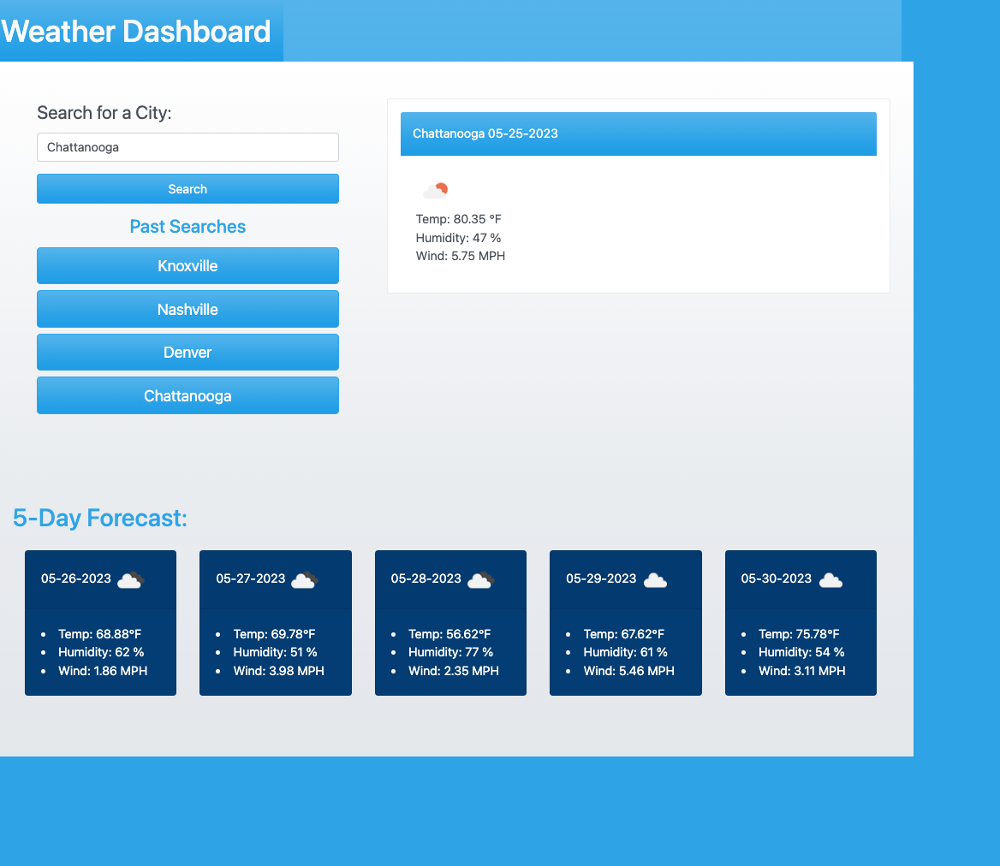

# weather-dashboard
## Description
The goal of this application is to create an interactive Weather Forecast Dashboard. This application utilizes HTML, Bootstrap CSS, Javascript, DayJS, local storage, and server-side APIs to achieve the following requirements: 

- a dashboard that displays a search form upon loading
- buttons that display the user's previous searches as stored in local storage
- a main card that presents user with the city they are searching, the current date, a list of weather conditions with a matching icon
- five cards that display a forecast including the date, weather conditions, and icon for each of the five following days
## Deployed Application

### URL
[Weather Dashboard](https://chesneyjulian.github.io/weather-dashboard/)

### Screenshot

## Usage
- to enter a city name, click on the text input field and type in valid city name
- to search for city, click search button below input field
- to search for a city in your past searches, click on the corresponding button with the city name

## Resources

[Bootswatch Theme Cerulean](https://bootswatch.com/cerulean/)

[Open Weather Map Current Weather Data API](https://openweathermap.org/current)

[Open Weather Map Forecast API](https://openweathermap.org/forecast5)

